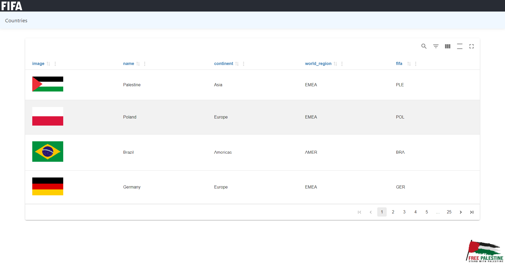
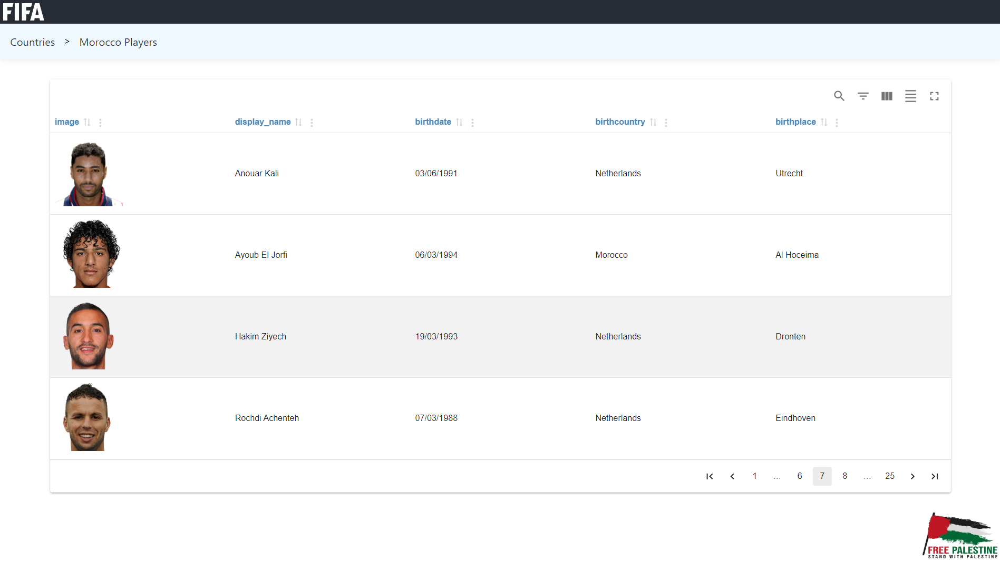
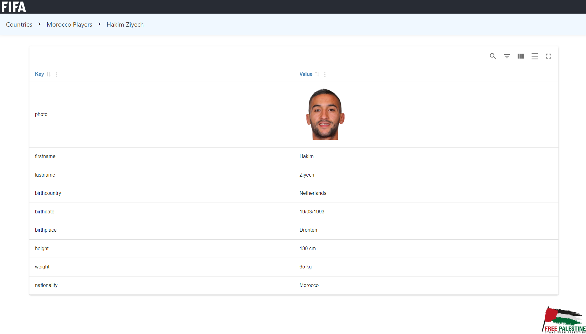

# football-players-info
React demo application presenting football players information.

# Application Overview
A simple SPA using react to build dynamic user interfaces based on components.

> 

> 

> 

In the project directory, you can installs the required dependencies: ### `npm install` and run the app in the development mode: ### `npm start`
